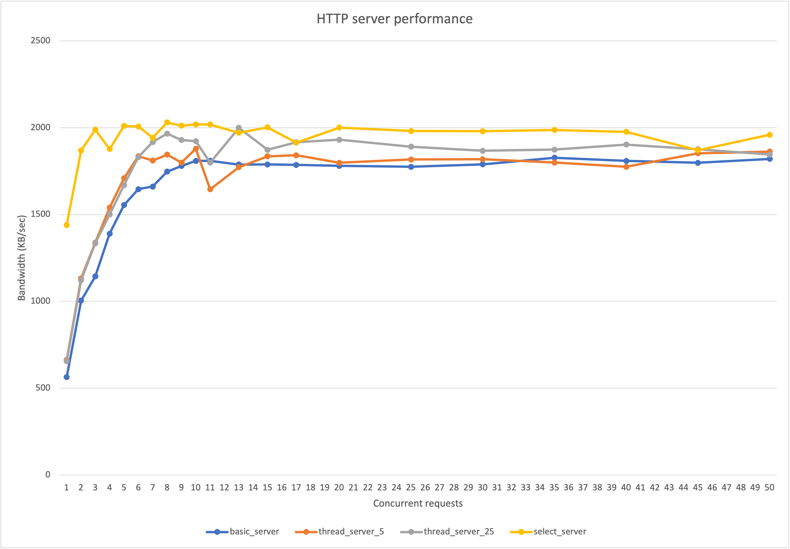
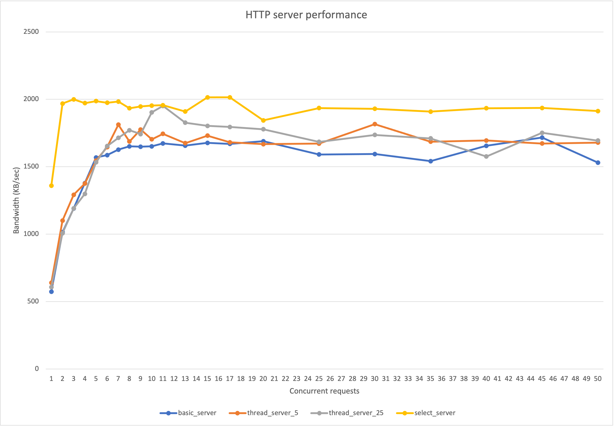

# RW_HTTPServer/1.0

Please first render this ``README`` file before reading

- Author: Richard Wu
- Date: 6 Oct 2021

The first section describes the basic design of the http server (i.e., part 1)

The second section describes Threadpool design and Select-Multiplexing design (i.e., part 2a and 2b)

The third section describes performance benchmarking (i.e., part 2d)

The last section discusses Netty and nginx (i.e., part 2c)

Please feel free to contact me at richard.wu@yale.edu if you have any question about running/testing this server.

## Basic HTTP Server for Part 1
### How to get started?

- Please run the command:
```
./run.sh
```
You should have a running server with ``-config ./config/httpd.conf``
### Files/Directories
#### Java file
- ``HTTPServer.java``: the main class
- ``HTTPRequestHandler.java``: handle the request
- ``VirtualHost.java``: virtual host class
- ``Util.java``: util functions
#### Jar file
- ``HTTPServer.jar``: the jar file to run. It can be produced by ``run.sh`` or ``compile.sh``
- ``commons-cli-1.4.jar``: the API for parsing command line argument (e.g., ``-config`` flag)
#### Shell script file
- ``compile.sh``: compile the java file to class file to jar file
- ``run.sh``: compile the java file to class file to jar file, and then run the jar file with ``-config ./config/httpd.conf``
- ``clean.sh``: do the cleanup
- ``test.sh``: script for testing the server, using the files in root and root2
#### Directories
- ``config``: host ``.conf`` configuration file
- ``root``: a root for a virtual host (used for testing)
- ``root2``: a root for a virtual host (used for testing)
#### Others
- ``MANIFEST.MF``: manifest file for ``HTTPServer.jar`` which sets up the classpath and main class
- ``README.md``: this file

### Implementation
- A per-thread, sequential processing handler server
- Use configuration file with Apache configuration style
- Static files that can be mapped by the server include ``.txt``, ``.html``, ``.jpg``. Other static files will be ``text/plain``
- Requests for the files out of the root directory will get ``403``
- Support ``Host`` header to serve multiple websites (virtual hosts) where each has a different root directory
- The first vitual host is the one used by default if ``Host`` header is not specified or ``Host`` is not found
- Send ``index.html`` or ``index_m.html``, if any, when the URL is a directory (any ``User-Agent`` that has substring "iPhone" or "phone" (case insensitive) will get ``index_m.html`` first, then ``index.html``, then ``404``)
- **Note that content negotiation headers (such as ``Accept``) are ignored, so the clients may get a representation of resource that they do not want or cannot accept. The server does not change the representation of resource based on the negotiation headers**
- Support ``If-Modified-Since`` header
- Support CGI for both ``GET`` and ``POST``: the environment variables the server sets include ``QUERY_STRING``, ``REMOTE_*``, ``REQUEST_METHOD``, ``SERVER_*``, ``CONTENT_LENGTH``
- The stdin of the CGI program will be pumped with the data from ``POST`` request if any. The stdout of the CGI program will be sent to the client, and the ``Transfer-Encoding`` will be ``chunked``: the server will chunk the response line by line (each chunk will be the entire line with ``\n``)
- The server will concatenate the http status line and the headers with the response from the CGI program. Thus, the CGI program should only be responsible for the data
- Support caching with cache size specified in the configuration file. If ``CacheSize <cache size in KB>`` is not specified, then no cache will be supported. The cache operates under the principle of "first come, first served" and there is no replacement policy. If a file is cached and then modified, unfortunately the old version will still be returned
- Support Heartbeat Monitoring through a virtual URL ``/load``, ``200`` or ``503`` will be returned indicating available or busy. When the number of threads currently used by the server reaches a preset maximum, ``503`` will be returned

## High-performance HTTP Server
### Concurrent HTTP Server using Threadpool
#### How to get started?

- Please run the command:
```
./run_thread.sh
```
You should have a running server with ``-config ./config/httpd_thread.conf``
#### Files/Directories
##### Java file
- ``ThreadHTTPServer.java``: the main class and the main thread
- ``ThreadHTTPRequestHandler.java``: thread in the pool that handles the request
- ``VirtualHost.java``: virtual host class
- ``Util.java``: util functions
##### Jar file
- ``ThreadHTTPServer.jar``: the jar file to run. It can be produced by ``run_thread.sh`` or ``compile_thread.sh``
- ``commons-cli-1.4.jar``: the API for parsing command line argument (e.g., ``-config`` flag)
##### Shell script file
- ``compile_thread.sh``: compile the java file to class file to jar file
- ``run_thread.sh``: compile the java file to class file to jar file, and then run the jar file with ``-config ./config/httpd_thread.conf``
- ``clean.sh``: do the cleanup
- ``test.sh``: script for testing the server, using the files in root and root2
##### Others
- ``MANIFEST_THREAD.MF``: manifest file for ``ThreadHTTPServer.jar`` which sets up the classpath and main class

#### Implementation
- A concurrent server using a thread pool: the main thread adding connection socket into a queue and a fix number of worker threads getting socket from it (with wait/notify primitives)
- The key features for HTTP protocol of this server are exactly the same as those of the basic server
- Heartbeat Monitoring now will return ``200`` if and only if there is nothing in the connection socket queue, i.e., there is no connection waiting to be served.

### Select-Multiplexing HTTP Server
#### How to get started?

- Please run the command:
```
./run_select.sh
```
You should have a running server with ``-config ./config/httpd.conf``

Note that select server shares the same config file with the basic server
#### Files/Directories
##### Java file
- ``SelectHTTPServer.java``: the main class and the main thread, i.e., event loop thread
- ``SelectHTTPRequestHandler.java``: the attachment of a Socket Channel which will handle reading/writing of this channel
- ``CommandThread.java``: a command thread that opens a terminal for the server manager and put commands into the command queue
- ``Command.java``: the abstract class for a command
- ``ShutdownCommand.java``: a shutdown command that extends ``Command.java``
- ``VirtualHost.java``: virtual host class
- ``Util.java``: util functions
##### Jar file
- ``SelectHTTPServer.jar``: the jar file to run. It can be produced by ``run_select.sh`` or ``compile_select.sh``
- ``commons-cli-1.4.jar``: the API for parsing command line argument (e.g., ``-config`` flag)
##### Shell script file
- ``compile_select.sh``: compile the java file to class file to jar file
- ``run_select.sh``: compile the java file to class file to jar file, and then run the jar file with ``-config ./config/httpd.conf``
- ``clean.sh``: do the cleanup
- ``test.sh``: script for testing the server, using the files in root and root2
##### Others
- ``MANIFEST_SELECT.MF``: manifest file for ``SelectHTTPServer.jar`` which sets up the classpath and main class

#### Implementation
- A select server using the selector: the event loop in the main thread uses ``selector.select()`` to handle ready events
- The key features for HTTP protocol of this server are exactly the same as those of the basic server
- Heatbeating Monitor uses cpu usage to return ``503`` or ``200``. If the current cpu usage is larger than some constant, e.g., 0.8, then ``503`` will be returned
- Server managers can type commands into the stdin, and the command thread will add the corresponding command into the command queue and wakeup the event loop to let it handle it. The event loop will handle it after handling the outstanding selection keys.
- The server supports the command ``shutdown``: the server will immediately shut down the server socket channel (i.e., no new connections will be accepted), wait for the current connections to finish, and finally shutdown
- The command of ``shutdown`` will only close the server socket channel
- Every time after the event loop handles some keys (and possibly closes some finished connections), it will check whether all of the current channels have been closed (i.e., ``shutdown`` command has been issued because the server socket channel has also been closed), if so, then shut down
- The server supports the command ``help``: print out usage information
- Since in our application there is no need for the event loop to synchronize with the command thread, the command thread will not wait for the command to finish using any complex nested structure
- All of the connections need to be finished in ``TIME_MAXIMUM`` (3000) millisecond. If not, the connections will for sure be killed under ``TIME_BUFFER`` (1000) millisecond.
- The timeout is implemented by using ``selector.select(TIME_BUFFER)`` so that the select function will block for at most ``TIME_BUFFER`` millisecond. Every time after the selector handles some requests, it will check the create time of every connection which is stored in the attachment ``SelectHTTPRequestHandler``. If the current time is over create time plus ``TIME_MAXIMUM``, kill this connection.

## Performance Benchmarking
Apache Benchmarking, i.e., ``ab``, is used to evaluate the performance of the three servers introduced above.

The following observations are made about the testing environment:
- Other programs running in the operating system, espicially those using internet, such as Chrome, may negatively affect the performance of the server. This is because when we stress test the server, its performance really depends on how much time the operating system can allocate for it to run. To solve this issue, all of the other user programs are turned off during testing.
- Between each test, we need to sleep for a couple seconds (10 seconds in the analysis below) to let the operating system release resources (such as closed sockets and dead threads) in order to get accurate performance. If we directly execute the next stress test right behind the first test, its performance will be negatively affected by the first test.
- We need to warm up the server before running any test. The server uses cache, so we want both the first and the rest stress tests to have fair performance results (that use the cache).
- ``-n requests`` and ``-c concurrency`` cannot be too big, otherwise the threads/sockets in the server queue or in the operating system buffer will pile up and eventually overflow and crash the server. In the analysis below, we use ``-n`` ``500`` and ``1000``, and ``-c`` from ``1`` to ``50`` 
- For the thread pool server, different pool sizes will have different performance, thus we pick pool size equal to 5 and 25 for testing
- The script ``run_benchmark.sh`` is used for testing HTML retrieval, with the results recorded in ``benchmark_result.txt``. You can use the following command:
```
./run_benchmark.sh [concurrency] [sleep time] [message]
```
- We use ``macOS Catalina 10.15.7`` with 2.3 GHz Quad-Core Intel Core i5 and Memory 8 GB 2133 MHz LPDDR3 for the testing below

The graph and table below show the relationship between concurrent requests and bandwidth (in ``KB/sec``)

When ``-n`` is ``500``:



| concurrency | basic_server | thread_server_5 | thread_server_25 | select_server |
|-------------|--------------|-----------------|------------------|---------------|
| 1           | 564.25       | 662.45          | 655.68           | 1440.32       |
| 2           | 1004.33      | 1132.2          | 1121.85          | 1868.89       |
| 3           | 1143.7       | 1338.7          | 1334.49          | 1988.46       |
| 4           | 1390.03      | 1539.63         | 1500.61          | 1877.3        |
| 5           | 1554.52      | 1709.05         | 1669.53          | 2010.47       |
| 6           | 1646.03      | 1835.89         | 1830.43          | 2007.06       |
| 7           | 1660.97      | 1810.69         | 1917.28          | 1941.86       |
| 8           | 1747.26      | 1844.73         | 1966.1           | 2030.55       |
| 9           | 1779.96      | 1799.42         | 1929.17          | 2011.36       |
| 10          | 1808.6       | 1878.58         | 1922.76          | 2019.12       |
| 11          | 1809.34      | 1645.5          | 1798.6           | 2018.38       |
| 13          | 1787.97      | 1773.24         | 1999.33          | 1970.68       |
| 15          | 1788.4       | 1835.57         | 1872.81          | 2002.03       |
| 17          | 1785.55      | 1841.68         | 1916.77          | 1913.77       |
| 20          | 1780.37      | 1798.06         | 1931.07          | 2000.84       |
| 25          | 1774.68      | 1817.04         | 1891.11          | 1981.23       |
| 30          | 1789.02      | 1818.48         | 1867.44          | 1979.48       |
| 35          | 1827.23      | 1799.3          | 1873.75          | 1986.97       |
| 40          | 1809.12      | 1774.74         | 1903.22          | 1976.68       |
| 45          | 1798.03      | 1852.75         | 1875.92          | 1870.54       |
| 50          | 1820.61      | 1862.53         | 1845.28          | 1959.2        |

When ``-n`` is ``1000``:



| concurrency | basic_server | thread_server_5 | thread_server_25 | select_server |
|-------------|--------------|-----------------|------------------|---------------|
| 1           | 572.97       | 639.08          | 607.2            | 1359.8        |
| 2           | 1014.81      | 1100.83         | 1007.18          | 1968.24       |
| 3           | 1189.92      | 1291.84         | 1190.89          | 1999.34       |
| 4           | 1378.53      | 1374.98         | 1298.65          | 1971.93       |
| 5           | 1568.08      | 1544.59         | 1532.57          | 1986.38       |
| 6           | 1585.91      | 1645.48         | 1653.12          | 1974.78       |
| 7           | 1626.99      | 1811.84         | 1714.42          | 1983.54       |
| 8           | 1651.18      | 1686.75         | 1770.3           | 1933.92       |
| 9           | 1648.6       | 1775.48         | 1741.77          | 1946.58       |
| 10          | 1651.32      | 1703.43         | 1903.03          | 1953.43       |
| 11          | 1672.44      | 1743.72         | 1950.8           | 1956.47       |
| 13          | 1656.88      | 1674.77         | 1826.4           | 1909.53       |
| 15          | 1676.55      | 1730.6          | 1803.1           | 2014.58       |
| 17          | 1669.48      | 1681.03         | 1795.15          | 2014.69       |
| 20          | 1689.04      | 1667.37         | 1777.95          | 1843.52       |
| 25          | 1590.81      | 1671.62         | 1684.13          | 1935.43       |
| 30          | 1593.88      | 1815.84         | 1735.72          | 1929.82       |
| 35          | 1541.35      | 1685.68         | 1710.13          | 1908.82       |
| 40          | 1655.49      | 1694.14         | 1575.67          | 1933.79       |
| 45          | 1716.27      | 1671.82         | 1751.31          | 1935.74       |
| 50          | 1530.06      | 1678.88         | 1693.81          | 1912.89       |
- It can be noticed that the performance of select server is overall better than the basic and thread pool servers
- **When number of requests sent is 1000, the highest performance for select server happens when concurrency equals to 17: the bandwidth is ``2014.69 KB/sec``, i.e., ``16.12Mbps``**
- The basic server and thread pool servers have roughly the same performance (i.e., ``1700 KB/sec``) after the concurrency has reached 10. The two thread pool servers are slightly better than the basic server.
- It can be noticed that when concurrency is between 5 and 25, the thread pool server with pool size 25 is mostly better than the server with pool size 5. This is reasonable because the smaller pool size server has run out of its threads and has to wait for the former connections to finish.

## Comparison of Designs
This section investigates on other server designs, specifically, Netty and nginx.

### Netty Design
---
1. Netty provides multiple event loop implementations. In a typical server channel setting, two event loop groups are created, with one typically called the boss group and the second worker group. What are they? How does Netty achieve synchronization among them?
> The boss group accepts an incoming connection. The worker group handles the traffic of the accepted connection once the boss accepts the connection and registers the accepted connection to the worker. Netty uses ``ServerBootstrap`` to register these two groups together to archieve synchronization. Each ``ServerSocketChannel`` has its own boss event loop group. Once an incoming connection is accepted successfully by the boss event group, it will pass the accepted channel to one of the worker threads in the worker group that the ``NioServerSocketChannelFactory`` manages and set ``SocketChannel``.
---
2. Netty event loop uses an ``ioRatio`` based scheduling algorithm. How it works?
> The ``ioRatio`` can take value range from 1-100. According to the API, the default value is 50 for ``ioRatio``: the event loop will try to spend the same amount of time for I/O as for non-I/O tasks. The higher the number, the more time can be spent on I/O tasks, and less time on the tasks in the task queue. If ``ioRatio == 100``, then the feature will be disabled: the event loop will ``processSelectedKeys`` first and then ``runAllTasks`` at the end. Otherwise, it will record the current time before ``processSelectedKeys`` and then record time again to compute the time spent on I/O. Then it will ``runAllTasks`` for the time calculated based on the I/O time and ``ioRatio`` by setting up a timeout. If there is no I/O task at all, it will run the minimum number of tasks.
---
3. A major novel, interesting feature of Netty is ``ChannelPipeline``. A pipeline may consist of a list of ``ChannelHandler``. Please scan Netty implementation and give a high-level description of how ``ChannelPipeline`` is implemented. Compare [HTTP Hello World Server](https://netty.io/4.0/xref/io/netty/example/http/helloworld/package-summary.html) and [HTTP Snoop Server](https://netty.io/4.0/xref/io/netty/example/http/snoop/package-summary.html), what are the handlers that each includes?
> A channel event is handled by a list of ``ChannelHandler`` in a ``ChannelPipeline`` which is created automatically when the channel is created. The pipeline implements a form of the Intercepting Filter pattern to give users the control to manipulate how an event is handled and how the handlers in the pipeline can interact with each other. An I/O event is handled by either a ``ChannelInboundHandler`` or a ``ChannelOutboundHandler`` and can be forwarded to its closest handler by calling the event propagation methods defined in ``ChannelHandlerContext``. Users only need to call ``pipeline.addLast`` to add handlers into the pipeline. HelloWorld Server includes ``HttpServerCodec`` and ``HttpHelloWorldServerHandler`` and possibly ``SslHandler`` if ``SslContext`` is used, in its pipeline. Snoop Server includes ``HttpRequestDecoder``, ``HttpResponseEncoder``, ``HttpSnoopServerHandler``, and possibly ``SslHandler`` if ``SslContext`` is used, in its pipeline. Snoop Client includes ``HttpClientCodec``, ``HttpContentDecompressor``, ``HttpSnoopClientHandler``, and possibly ``SslHandler`` if ``SslContext`` is used, in its pipeline. 
---
4. Method calls such as ``bind`` return ``ChannelFuture``. Please describe how one may implement the sync method of a future.
> In Netty, all I/O operations are asynchronous: any I/O calls will return a ``ChannelFuture`` immediately with no guarantee that the requested I/O operation has been completed. A ``ChannelFuture`` represents the status of the I/O operation. The synchronization is implemented as follows: the users need to add a ``ChannelFutureListener`` to the ``ChannelFuture``. The listener will be registered to the I/O thread, so the I/O thread will directly call the ``operationComplete`` method of the listener inside the I/O thread when the I/O operation associated with the future is done . An alternative is to call ``await`` method of the future, which will block and wait on a condition variable. The I/O thread will notify the condition variable when the operation is done.
---
5. Instead of using ``ByteBuffer``, Netty introduces a data structure called ``ByteBuf``. Please give one key difference between ``ByteBuffer`` and ``ByteBuf``.
> Instead of ``position`` pointer and ``limit`` pointer in ``ByteBuffer``, ``ByteBuf`` has two separate pointers: one for read operations, i.e., ``readIndex``, and the other for write operations, i.e., ``writeIndex``. (Of course, ``ByteBuf`` still has ``capacity``). The writer index increases as something is written to a ``ByteBuf`` while the reader index remains unchanged. The reader index and the writer index represents where the message starts and ends respectively, and there is no need to call ``flip`` when doing read after write.

### nginx Design
---
1. Although nginx has both Master and Worker, the design is the symmetric design: multiple Workers compete on the shared welcome socket (accept). One issue about the design is that this design does not offer flexible control such as load balance. In ``ngx_event_accept`` (``src/event/ngx_event_accept.c``), a worker initializes a variable ``ngx_accept_disabled = ngx_cycle->connection_n / 8 - ngx_cycle->free_connection_n``. In the event loop, ``ngx_process_events_and_timers()`` (``src/event/ngx_event.c``) of a worker uses this variable to control accepting new connections. Can you please describe what it does? Related with the shared accept, one issue is that when a new connection becomes acceptable, multiple workers can be notified, creating contention. Please read nginx event loop and describe how nginx tries to resolve the contention.
> The variable ``ngx_accept_disabled``, from my perspective, is a semaphore-like field, defined in ``ngx_event_accept``. It is used to check whether the current thread may be accepting too many connections. If it is greater than 0, it will not try to get the accept mutex, and decrement ``ngx_accept_disabled``. Otherwise, the number of connections does not overload the thread: it will try to get the mutex (i.e., compete with other threads). If successful, the flag is set to ``NGX_POST_EVENTS``, meaning that the event will be handled later in the event loop when the lock is released. Then the thread will continue to process the existing connections.
---
2. The nginx event loop (``ngx_process_events_and_timers``) processes both io events and timers. What type of data structure does nginx use to keep track of timers? If it were nginx, how would you implement the 3-second timeout requirement of this project?
>  Nginx uses a global timeout red-black tree ``ngx_event_timer_rbtree`` which stores all timeouts currently set by the program. According to the developer guide, the key in the red-black tree is of type ``ngx_msec_t`` and is the time when the event occurs. The tree structure can make insertion and deletion operations faster, and help the event loop access the nearest timeouts, which is used to determine how long to wait for I/O events. If it were nginx, we would use the function ``ngx_add_timer(ev, timer)`` to set a timeout for an event. The event loop will be waked up and kill the expired connection.
---
3. It is said that nginx processes HTTP in 11 stages. What are the stages?
> According to the developer guide, the 11 stages are listed as follows:
> 1. `NGX_HTTP_POST_READ_PHASE` ― First phase: the ``ngx_http_realip_module`` registers its handler at this phase to enable substitution of client addresses
> 2. `NGX_HTTP_SERVER_REWRITE_PHASE` ― Phase where rewrite directives defined in a ``server`` block are processed
> 3. `NGX_HTTP_FIND_CONFIG_PHASE` ― Special phase where a location is chosen based on the request URI
> 4. `NGX_HTTP_REWRITE_PHASE` ― rewrite rules defined in the location, chosen in the previous phase
> 5. `NGX_HTTP_POST_REWRITE_PHASE` ― Special phase where the request is redirected to a new location if its URI changed during a rewrite
> 6. `NGX_HTTP_PREACCESS_PHASE` ― A common phase for different types of handlers
> 7. `NGX_HTTP_ACCESS_PHASE` ― Phase where it is verified that the client is authorized to make the request
> 8. `NGX_HTTP_POST_ACCESS_PHASE` ― Special phase where the satisfy any directive is processed
> 9. ``NGX_HTTP_PRECONTENT_PHASE`` ― Phase for handlers to be called prior to generating content
> 10. `NGX_HTTP_CONTENT_PHASE` ― Phase where the response is normally generated
> 11. `NGX_HTTP_LOG_PHASE` ― Phase where request logging is performed
---
4. A main design feature of nginx is efficient support of upstream; that is, forward request to an upstream server. Can you describe the high level design?
> Nginx supports http proxying, fastcgi, etc. As discussed in the developer guide, the ``ngx_http_upstream_module`` provides the basic functionality needed to pass requests to remote servers. We can specify an entire pools of backend servers that we can pass requests to, using the ``upstream`` directory. Nginx uses weighted round robin as the default load balancing algorithm. It also supports dynamically configurable group with periodic health checks.
---
5. nginx introduces a buffer type ``ngx_buf_t``. Can you briefly compare ``ngx_buf_t`` vs ``ByteBuffer`` in Java nio?
> Nginx provides buffer via the type ``ngx_buf_t``, which has ``start``, ``end``, ``pos``, ``last`` to mark boundary, and different flags indicating whether the memory referenced is writable/read-only/data in a file, etc. Instead of a single buffer in Java nio, nginx uses a chain of buffer to handle input and output operations, via the type ``ngx_chain_t``. Programs need to link the buffers together using the linked list like data structure.